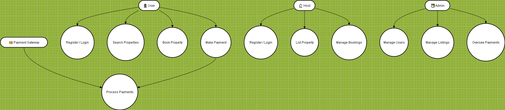

# Use Case Diagram

This use case diagram visualizes the main interactions between users and the system in the **Airbnb Clone** project.

## Diagram

## Description

- **User** can register, login, search for properties, book a property, and make payments.  
- **Host** can list properties, manage bookings, and view payment status.  
- **Admin** can manage users, properties, and bookings.  
- **Payment Gateway** is responsible for handling payment processing.
